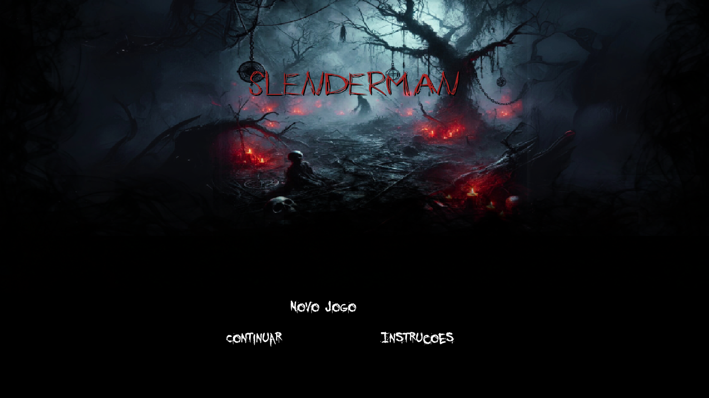
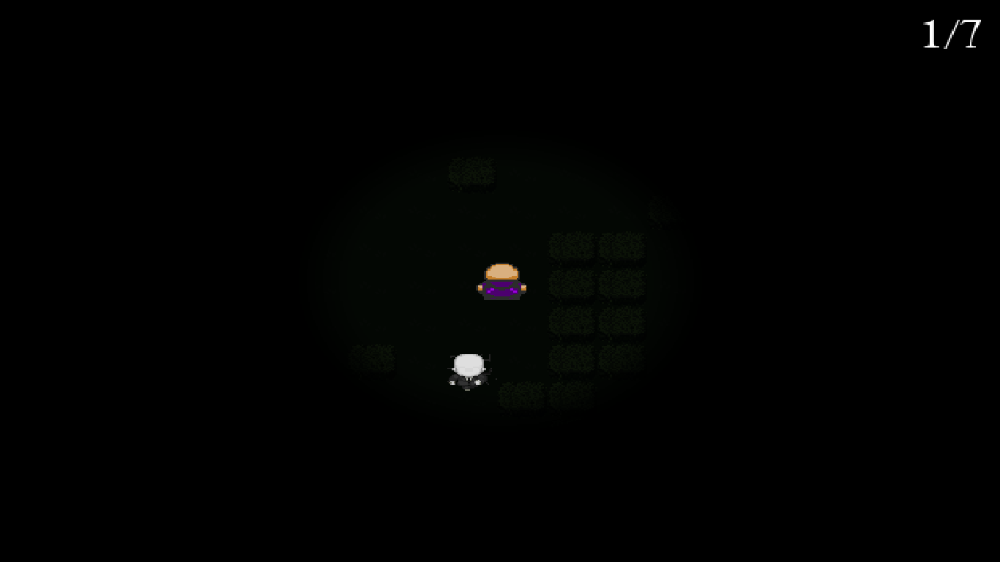
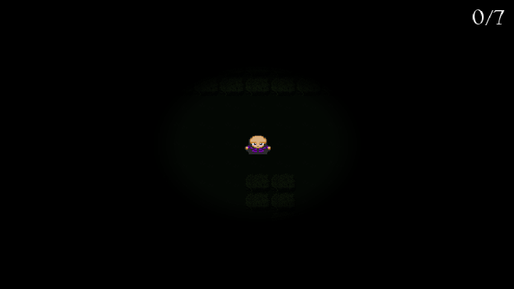
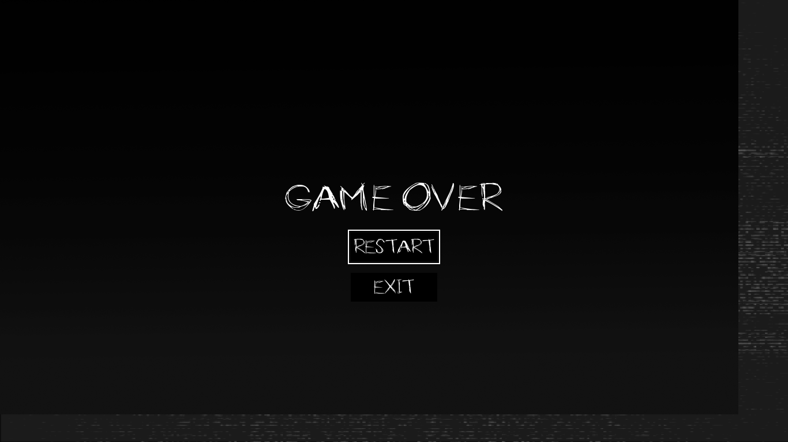

# PD_SlendermanReturns

**Número da Lista**: 37  
**Conteúdo da Disciplina**: Programação dinâmica  

## Alunos

| Matrícula   | Aluno                          |
| ----------- | ------------------------------ |
| 221037975   | Natália Rodrigues de Morais    |
| 221021975   | Gabriel Santos Monteiro        |

## Sobre

O projeto é um jogo de sobrevivência chamado **Slenderman**, no qual o jogador é perseguido pela criatura Slenderman e deve coletar notas para vencer. Este jogo utiliza conceitos de programação dinâmica para otimizar o movimento do inimigo e a geração do mapa.

### Uso de Programação Dinâmica

A programação dinâmica foi implementada no algoritmo de pathfinding do Slenderman, utilizando o algoritmo de Bellman-Ford para encontrar o caminho mais curto até o jogador. Este método considera os pesos diferentes de cada tipo de tile no mapa, permitindo uma perseguição mais eficiente e realista.

## Screenshots

| Tela de Introdução                         | Tela de Jogo                               |
| ------------------------------------------ | ------------------------------------------ |
|                     |                       |

| Tela de Início do Jogo                     | Tela de Fim de Jogo                        |
| ------------------------------------------ | ------------------------------------------ |
|                     |                         |

## Instalação 

**Linguagem**: Python  
**Framework**: Pygame  

### Pré-requisitos

1. Python 3.x instalado.
2. Pygame instalado. Você pode instalar usando:
   ```bash
   pip install pygame
   ```

### Rodando o jogo

1. Clone o repositório.
2. Navegue até o diretório do projeto.
3. Execute o jogo com o comando:
   ```bash
   python start.py
   ```

## Uso

Ao iniciar o jogo, você verá uma tela de menu principal com três opções: **Novo Jogo**, **Continuar** e **Instruções**.  

1. Selecione **Novo Jogo** para começar uma nova partida.
2. **Instruções** mostrará as regras e controles do jogo.

### Controles

- `W` / `A` / `S` / `D` para mover-se.
- O objetivo é coletar todas as notas sem ser pego pelo Slenderman.

## Implementação

O jogo utiliza várias técnicas de programação dinâmica e otimização:

1. **Algoritmo de Bellman-Ford**: Implementado na classe `Enemy` para calcular o caminho mais curto até o jogador, considerando os pesos dos diferentes tipos de terreno.

2. **Sistema de Pesos**: Definido em `config.py`, atribui diferentes valores para cada tipo de tile, influenciando as decisões de movimento do Slenderman.

3. **Atualização Dinâmica de Caminho**: O Slenderman recalcula seu caminho periodicamente, adaptando-se aos movimentos do jogador.

4. **Teleporte Inteligente**: Quando o jogador coleta uma nota, o Slenderman pode se teleportar para uma posição estratégica, utilizando cálculos baseados na posição atual do jogador.

## Apresentação

Este projeto foi desenvolvido para aplicar conceitos de programação dinâmica em uma simulação prática de perseguição e busca.

- [Vídeo de apresentação PD]()
